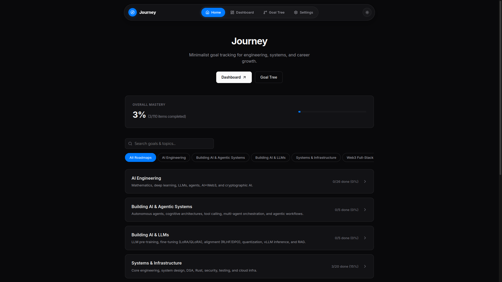
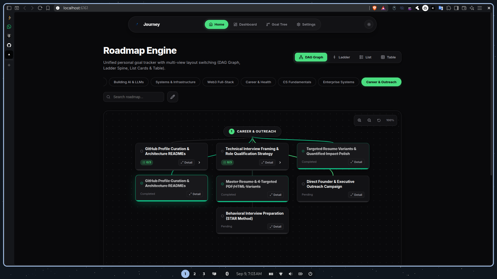

<p align="center">
  
</p>

<h1 align="center">Journey</h1>

<p align="center">
  <strong>Universal Goal Engine, Local Web Portal & Model Context Protocol (MCP) Server</strong>
</p>

<p align="center">
  <a href="https://www.npmjs.com/package/@ziuus/journey"></a>
  <a href="LICENSE"></a>
</p>

<p align="center">
  Journey is a local-first goal tracking and mastery engine with a Next.js web portal and a built-in MCP server. It manages skill trees, mastery roadmaps, and daily task priorities through a single JSON file (<code>~/.journey/data/roadmap.json</code>) accessible by both humans and AI agents in real time.
</p>

---

<p align="center">
  
</p>

<br/>

<p align="center">
  
</p>

---

## System Architecture

```
┌─────────────────────────────────────────────────────────┐
│                   Journey Web Portal                    │
│                (http://localhost:6161)                  │
│   • Home Overview          • Execution Dashboard        │
│   • Goal Tree Graph        • 24 Preset Themes           │
└────────────────────────────┬────────────────────────────┘
                             │ reads & writes
┌────────────────────────────▼────────────────────────────┐
│            ~/.journey/data/roadmap.json                 │
│        (User's Local Goal & Mastery Data)               │
└────────────────────────────▲────────────────────────────┘
                             │ MCP / Stdin-Stdout
┌────────────────────────────┴────────────────────────────┐
│             AI Assistants & MCP Clients                 │
│ (Claude Code, OpenCode, Hermes, Cursor, Windsurf, etc.) │
└─────────────────────────────────────────────────────────┘
```

---

## Core Capabilities

- **Local-First & Private**: Personal data remains stored locally at `~/.journey/data/roadmap.json`. Requires no external databases, account creation, or cloud services.
- **Model Context Protocol (MCP)**: Native `journey-mcp` executable exposing JSON-RPC 2.0 tools (`get_roadmap`, `add_goal`, `update_item_status`) for seamless AI integration.
- **24 Theme Color Combos**: Includes 24 harmonized color theme presets (*Dracula, Nord, Gruvbox, Tokyo Night, Monokai, Rosé Pine, Synthwave, Catppuccin, Cyberpunk, and Clean Light/Dark*) with automatic YIQ text contrast adjustment.
- **Algorithmic Execution Engine**: Evaluates task priority, career ROI, and dependencies to synthesize daily focus items and surface blocked goals on the Dashboard.
- **Interactive Goal Graph**: Visual node tree interface allowing direct inline node creation, deletion, status updates, and track filtering.
- **Density Scaling**: Toggle between *Comfortable* and *Compact* layout densities for different display sizes.

---

## Quick Start

### 1. Installation

Install Journey globally via npm:

```bash
npm install -g @ziuus/journey
```

> **Upgrading**: To update an existing global installation:
> ```bash
> npm install -g @ziuus/journey@latest
> ```

### 2. Launch Portal

Start the background web service:

```bash
journey
```

Navigate to `http://localhost:6161`. Journey automatically creates a starter roadmap file at `~/.journey/data/roadmap.json` on initial launch if one does not exist.

---

## Interface Guide

| View | Path | Primary Purpose |
|---|---|---|
| **Overview** | `/` | Track-by-track accordion hierarchy, global progress statistics, search filtering. |
| **Dashboard** | `/dashboard` | Algorithmic focus recommendation engine, high-ROI target lists, dependency warning panels. |
| **Goal Tree** | `/tree` | Full-screen interactive DAG node graph view with live node editing tools. |
| **Settings** | `/settings` | Theme selector (24 presets), custom accent override, density mode, default landing view preferences. |

---

## Agent Configuration Guide (MCP Setup)

Journey supports any agent using the Model Context Protocol (MCP). Since different AI CLI tools and IDEs use different configuration formats, find your agent below for step-by-step setup instructions:

### 1. Claude Code (CLI)
Run the built-in MCP CLI command:
```bash
claude mcp add journey journey-mcp
```
Or with NPX (zero-install):
```bash
claude mcp add journey npx -y @ziuus/journey journey-mcp
```

---

### 2. OpenCode Interpreter
Run in your terminal:
```bash
opencode mcp add journey journey-mcp
```
Or add to `~/.config/opencode/mcp.json`:
```json
{
  "mcpServers": {
    "journey": {
      "command": "journey-mcp"
    }
  }
}
```

---

### 3. Hermes Agent
Run in terminal:
```bash
hermes mcp add journey journey-mcp
```
Or add to `~/.hermes/mcp.json`:
```json
{
  "mcpServers": {
    "journey": {
      "command": "journey-mcp"
    }
  }
}
```

---

### 4. Claude Desktop
Add to your `claude_desktop_config.json`:
- **macOS**: `~/Library/Application Support/Claude/claude_desktop_config.json`
- **Linux**: `~/.config/Claude/claude_desktop_config.json`
- **Windows**: `%APPDATA%\Claude\claude_desktop_config.json`

```json
{
  "mcpServers": {
    "journey": {
      "command": "journey-mcp"
    }
  }
}
```

---

### 5. Cursor IDE
Open **Cursor Settings → Features → MCP** or edit `.cursor/mcp.json` in your project root:

```json
{
  "mcpServers": {
    "journey": {
      "command": "journey-mcp"
    }
  }
}
```

---

### 6. Windsurf (Codeium)
Add to `~/.codeium/windsurf/mcp_config.json`:

```json
{
  "mcpServers": {
    "journey": {
      "command": "journey-mcp"
    }
  }
}
```

---

### 7. Roo Code / Cline (VS Code)
Open **Roo Code Settings → MCP Servers → Add New MCP Server** or edit `cline_mcp_settings.json`:

```json
{
  "mcpServers": {
    "journey": {
      "command": "journey-mcp"
    }
  }
}
```

---

### 8. Zed Editor
Add to `~/.config/zed/settings.json`:

```json
{
  "context_servers": {
    "journey": {
      "command": "journey-mcp"
    }
  }
}
```

---

### 9. Goose CLI
Add to `~/.config/goose/config.yaml`:

```yaml
mcpServers:
  journey:
    command: journey-mcp
```

---

### 10. Continue.dev (VS Code & JetBrains)
Add to `~/.continue/config.json`:

```json
{
  "mcpServers": [
    {
      "name": "journey",
      "command": "journey-mcp"
    }
  ]
}
```

---

### 11. Zero-Install Alternative (NPX)
If you prefer not to install globally, you can use `npx` in any MCP config:

```json
{
  "mcpServers": {
    "journey": {
      "command": "npx",
      "args": ["-y", "@ziuus/journey", "journey-mcp"]
    }
  }
}
```

---

## MCP Tools Reference

When connected, AI agents automatically discover and execute these 3 tools:

| Tool | Input Parameters | Description |
|---|---|---|
| `get_roadmap` | *None* | Reads the user's complete roadmap and goal tree from `~/.journey/data/roadmap.json`. |
| `add_goal` | `layerId`, `title`, `goal` | Inserts a new goal into a specified roadmap layer. |
| `update_item_status` | `type`, `itemId`, `status` | Updates target item status (`pending` or `done`). |

---

## Direct File Reference (For Non-MCP Agents)

For agents without native MCP support (e.g. Gemini CLI, ChatGPT Web, custom scripts), simply inform your agent:

> *"My goal roadmap is stored at `~/.journey/data/roadmap.json`. Read this file to track my active goals and progress."*

| Environment | Strategy |
|---|---|
| **Gemini CLI** | Reference [`GEMINI.md`](./GEMINI.md) in your workspace context. |
| **Claude Code** | Include [`AGENTS.md`](./AGENTS.md) at your project root. |
| **Custom Agents** | Read/write directly to `~/.journey/data/roadmap.json`. |

---

## CLI Command Reference

| Command | Action |
|---|---|
| `journey` | Launches background portal process on port 6161 |
| `journey dev` | Runs development portal in foreground on port 3000 |
| `journey status` | Queries current background service state |
| `journey stop` | Terminates background portal service |
| `journey logs` | Displays real-time portal process logs |
| `journey-mcp` | Runs stdio Model Context Protocol server |

---

## Data Structure & Filesystem Layout

```
journey/
├── src/                    # Next.js 16 Web Portal Application
│   ├── app/                # Application routes (/ , /dashboard, /tree, /settings)
│   ├── components/         # Navigation bar, Footer, and SVG Logo components
│   ├── config/             # Theme metadata & default system configurations
│   ├── context/            # Global preference & theme context provider
│   └── lib/                # Roadmap normalizers & scoring algorithm
├── data/
│   └── roadmap.json        # Repository starter template (Do NOT write user data here)
├── scripts/
│   ├── journey-cli.js      # CLI service manager executable
│   └── mcp-server.js       # Model Context Protocol stdio server executable
└── ~/.journey/data/        # User storage location (roadmap.json)
```

> **Data Separation Policy**:
> - **User Roadmap**: Saved strictly to `~/.journey/data/roadmap.json` outside the source directory.
> - **Starter Template**: The repository file `data/roadmap.json` provides initial default schema structure for new installations.

---

## License

MIT © [ziuus](https://github.com/ziuus)